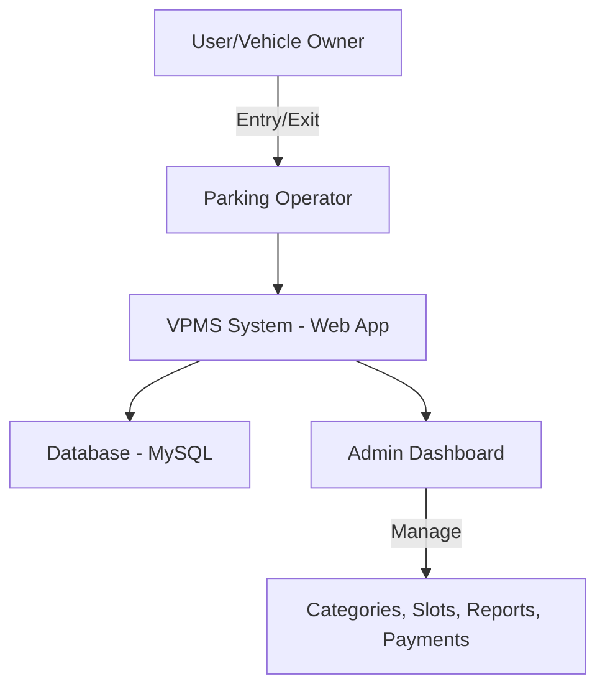

# 🚗 Vehicle Parking Management System (VPMS)

A **PHP & MySQL** web application that automates vehicle parking management — admins manage categories, slots, and payments, while operators handle vehicle check-in/check-out. Built for colleges, offices, malls, and public parking areas to replace manual records with digital management.

## 🎯 Objectives

- Manage vehicle entries and exits efficiently
- Categorize vehicles (2-wheeler, 4-wheeler, etc.)
- Track parking slot availability
- Maintain digital payment records
- Provide admin authentication & role-based access
- Reduce manual paperwork and errors

## ⚙️ System Architecture



## 🖥️ Tech Stack

| Layer | Technology |
|---|---|
| Frontend | HTML, CSS, Bootstrap, JavaScript (jQuery) |
| Backend | PHP (Core PHP, procedural) |
| Database | MySQL (XAMPP / LAMP / WAMP) |
| Server | Apache |

## 📊 Features

- 🔑 **Admin Authentication** — secure login, forgot password & reset
- 🚘 **Vehicle Entry/Exit** — record and update check-in/check-out details
- 📂 **Category Management** — add/edit/delete vehicle categories
- 💰 **Payment Tracking** — manage parking fees per category
- 📑 **Reports & History** — generate parked-vehicle reports
- 📡 **Responsive UI** — mobile-friendly dashboard

## 🛠️ Installation & Setup

**Requirements:** PHP 7+, MySQL 5.7+, XAMPP/WAMP/LAMP

```bash
# 1. Clone the repository
git clone https://github.com/Milind1234/Vehicle-Parking-Management-System.git

# 2. Move project to server directory
# XAMPP → htdocs/  |  WAMP/LAMP → www/

# 3. Create database in phpMyAdmin
CREATE DATABASE vpms;
# then import database/vpms.sql

# 4. Configure DB connection in includes/dbconnection.php
$con = mysqli_connect("localhost","root","","vpms");

# 5. Start Apache & MySQL, then open:
http://localhost/Vehicle-Parking-Management-System/vpms/
```

## 🔐 Default Admin Credentials

- **Username:** `admin`
- **Password:** `admin123` *(change later in the dashboard)*

## 📷 Screenshots

| Login | Dashboard |
|---|---|
|  |  |

| Vehicle Entry | Category Management |
|---|---|
|  |  |

## 🚀 Future Enhancements

- 📱 Mobile app (Android/iOS) integration
- 🎟️ QR code / RFID-based parking
- 🛰️ IoT sensors for auto slot detection
- ☁️ Cloud deployment for multi-location parking

---

## 📜 License

Licensed under the **MIT License** — free to use and modify with attribution.


